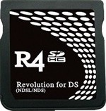

# Latest version Kernel for R4 SDHC

Kernel for R4 SDHC from `r4sdhc.com` or `ndslr4.com`.

**No more** `Save file not founded` or `r4dldi.dat error`, It just **works**!

## How to use:
1. Download files [here](https://github.com/SLAzurin/R4_SDHC_YSMenu_RGF_7.06_v1.32/archive/refs/heads/main.zip) and extract them to your sd card.
2. Open `YSMenu.nds`, create a save.
2. **If** YSMenu has a <u>grey background</u> or <u>freezes</u> or <u>has any error</u>, reboot your nds, open `Wood R4.nds`, create a save, reboot your nds, re-open `YSMenu.nds`.
3. YSMenu should have a dark colored background. You can now open your other `.nds` backups. You are done.
4. (Optional) Rename `YSMenu.nds` and `YSMenu.SAV` to `DEFAULT.nds` and `DEFAULT.SAV` only after everything works.

These files hosted here are basically a mashup of the below references.

## References:

Wood R4 for clones v1.42: https://gbatemp.net/download/wood-r4-for-clones.26997/

Original Kernel v1.32: https://www.linfoxdomain.com/nintendo/ds/ (<u>**R4 SDHC**</u>)

(Alternate) Original Kernel v1.34: https://github.com/DS-Homebrew/flashcard-archive/tree/main/files/YSMenu/r4sdhc.com

(Alternate) Original Kernel v1.34: https://github.com/DS-Homebrew/flashcard-archive/tree/main/files/ndslr4.com

RetroGameFan's YSMenu v7.06: https://gbatemp.net/threads/retrogamefan-updates-releases.267243/